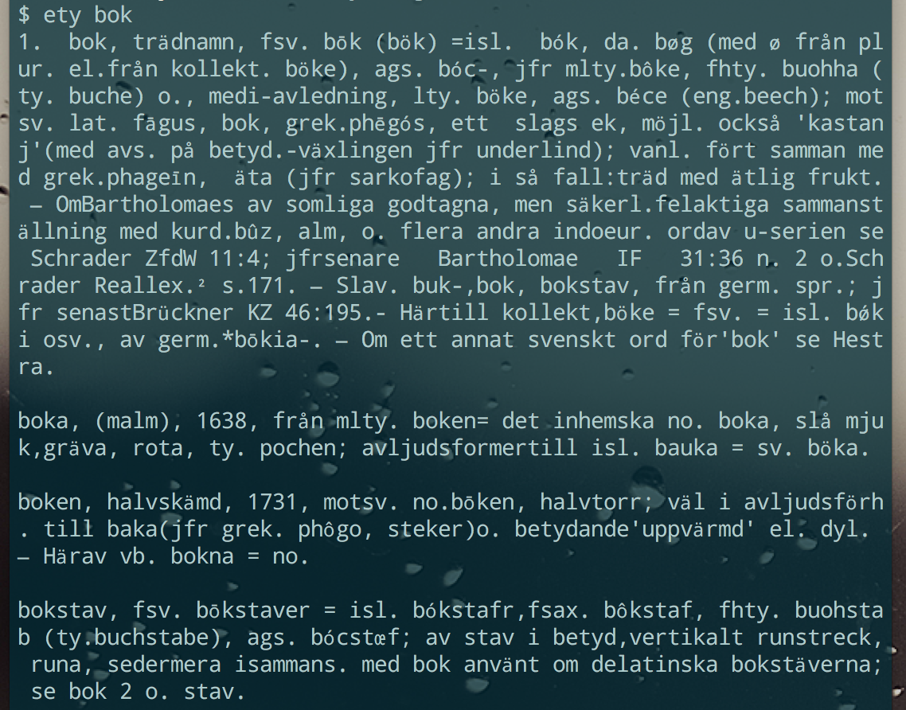

## Etymologi

### Introduktion
Etymologi är ett terminalgränssnitt för att söka efter ords ursprung. Det använder sig av Elof Hellquists [Svensk etymologisk ordbok](http://runeberg.org/svetym/) från Runeberg.org. Den digitaliserade versionen är fri från upphovsrätt och publicerades år 1929. Materialet är inscannat och automatiskt OCR-avläst, så det förekommer vissa fel.

Med hjälp av skriptet går det snabbt, och enkelt att ta reda på ursprunget för ett ord:

 

### Installation

* Ladda ner datamaterial [här](http://runeberg.org/download.pl?mode=txtzip&work=svetym) och packa upp till valfri katalog.
* Klona det här repot och lägg ety.rb någonstans i din PATH (eller gör en symlänk till `./ety`).
* Editera ety.rb och ändra sökvägen till Pages-katalogen (värdet för variabeln `@files_dir`
* Installera [The Silver Searcher](https://github.com/ggreer/the_silver_searcher) (på Mac enklast: `brew install the_silver_searcher`). Detta program är vad som gör att det går så snabbt att söka.


### Användning

Starta en terminalemulator och skriv:

```ety [sökord]```

### Licens och friskrivning

Fri att använda hur du vill. Inga garantier att detta inte får din dator att brinna upp. Men det är inte så troligt. Det kan förekomma fel som gör att sökresultat saknas eller visas fel. Skapa gärna en issue om du hittar något sådant problem.